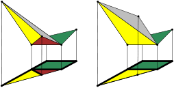

<p align="center">
  
</p>

`ResPol` is a software to compute projections of the Newton polytopes of the
resultant of a given polynomial system, the dicriminant of a multivariate polynomial
or the principal A-determinant a.k.a. the secondary polytope.

## Compile and use

This archive contains patches to sources of the `CGAL` library, the old experimental
`CGAL` packages `Triangulation` and `Extreme points` (not the one that are part
of the `CGAL` library, both were included here thanks to the kind permission of
its authors) and the `respol` sources. Both `CGAL` and `respol` are written in `C++`.

To compile and use `respol`, you need first to compile the `CGAL` library,
or download the precompiled library (this software has been tested with `CGAL`
version `4.14` available from https://github.com/CGAL/cgal/tree/v4.14).

You can follow these steps:


### Compile dependencies

Follow the `CGAL` installation manual. It states that `CGAL` requires the
`Boost` libraries. In particular the header files and the threading library
binaries. Having `GMP` version 4.2 or higher and MPFR version 2.2.1 or higher
installed is recommended by `CGAL` but needed by `respol`.
Once you have installed these libraries, execute:

```
$ cmake .
$ make
```

Download and install the LEDA library from
https://www.algorithmic-solutions.com/index.php/products/leda-free-edition

Then copy the `libleda.a` file shipped with LEDA into `respol` directory.

### Compile `respol` sources

In folder `respol` execute:

```
$ cmake -DCGAL_DIR=_YOUR_CGAL_PATH_ -Wno-dev .
$ make
```

where `_YOUR_CGAL_PATH_` is the path where `CGAL` library was compiled.
For additional options, set by CMake flags, see README.FLAGS
(it is normally not needed to change default compilation options).

The following command will execute the test-suite
```
$ ctest
```


### Use `respol` for resultant polytopes

Then, you can test the code with some inputs from the `examples/input` directory. The format of the input files is:

- 1st line: dimension (i.e. the number of the system variables)
- 2nd line: the cardinalities of the supports '|' the projection
- 3rd line: the support points

`respol` supports:

(a) computations of projections defined by implicitization problems

(b) computations of arbitrary projections

(c) generic resultant polytope computations

The second line of the input file defines the projection and actually
selects one of the above options:

(a) is supported by not defining any projection (omitting `|`), in this case, the non specialized coord's are the first from each support

(b) by defining an arbitrary projection, by giving the indices (starting at `0`) of free parameters: those not included here are specialized,

(c) by providing only the symbol `|`.

Input example (file: `inputs/cayley4_small.tmp`)

```
3
3 3 3 3
[[0, 0, 0],[1, 2, 1],[0, 2, 4], [0, 0, 0],[0, 1, 3],[2, 4, 0], [0, 0, 0],[0, 0,
1], [2, 0, 0], [0, 0, 0], [0, 1, 4],[0, 1, 5]]
```

This input belongs to the case
(a) *i.e* implicitization.
By adding `| 0 2 5 6 7 8 9` in the second line, we are in the case
(b) *i.e.* arbitrary projection. On the other hand, by adding only `|` we are in the case
(c) *i.e.* generic resultant polytope.

To run `respol` with this input execute:

`
$ ./res_enum_d -v 2 < resultant_examples/cayley4_small.tmp
`

### `respol` output

The `-v 2` verbose option will return information about the algorithm execution
and at the end the vertices of the computed polytope as well as the volume.
*E.g.* for the above command:

```
volume:					4575/1

The vertices of the  resultant polytope:
[6,4,11,12],[0,0,0,30],[12,8,16,16],[12,8,8,16],[12,0,4,0],[6,0,4,0],[6,0,0,4],[0,0,3,12],[12,4,4,0],[12,8,0,24],[12,0,0,4],[12,0,8,0],[12,4,12,0],[6,0,7,0],[6,4,3,12],[0,0,0,15],[12,4,0,4],[0,0,6,12],[6,4,0,15],[6,4,11,12]
```

Using option `-v` with argument `1` we can have a compressed version of output
while with `-v 0` we get only the number of output vertices (used by the test-suite).

### `respol` for discriminant and secondary polytopes

`respol` can be used to compute discriminant and secondary polytopes. Example files are
in `discriminant_examples` and `secondary_examples` directories respectively.

#### Credits

Copyright (c) 2012-2019 Vissarion Fisikopoulos  
Copyright (c) 2012-2019 Luis Penaranda  

Maintainer: [Vissarion Fisikopoulos](https://github.com/vissarion)

You may redistribute or modify the software under the GNU Lesser General Public License as published by Free Software Foundation, either version 3 of the License, or (at your option) any later version. It is distributed in the hope that it will be useful, but WITHOUT ANY WARRANTY.  

The development started by Vissarion Fisikopoulos and Luis Penaranda while they were affiliated with University of Athens (UoA, Greece).

#### Publications
1. An oracle-based, output sensitive algorithm for projections of resultant polytopes.  
*I.Z.Emiris, V.Fisikopoulos, C.Konaxis, L.Peñaranda.*  
International Journal of Computational Geometry and Applications, vol. 23, pp. 397-423, World Scientific, 2013.  
https://vissarion.github.io/publications/EFKP_IJCGA_13.pdf

2. An output-sensitive algorithm for computing projections of resultant polytopes.  
*I.Z.Emiris, V.Fisikopoulos, C.Konaxis, L.Peñaranda.*  
Proceedings of 28th ACM Annual Symposium on Computational Geometry, 2012, Chapel Hill, NC, USA.  
https://vissarion.github.io/publications/EFKP_SOCG_12.pdf
